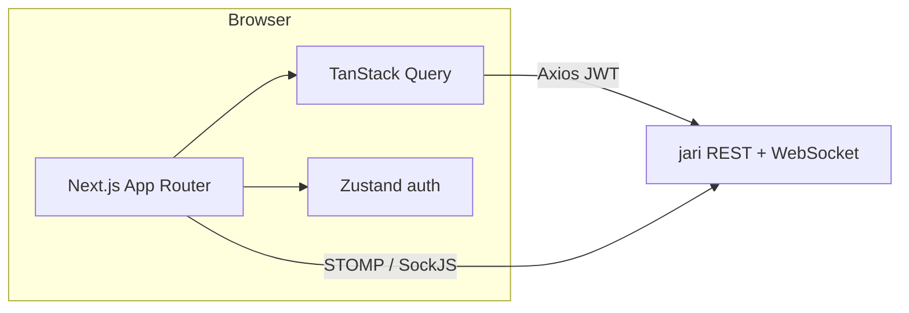

# Jari Client

[](https://nextjs.org/)
[](https://react.dev/)
[](https://www.typescriptlang.org/)
[](https://github.com/phihocnguyen/jari)

```
     ██╗ █████╗ ██████╗ ██╗
     ██║██╔══██╗██╔══██╗██║
     ██║███████║██████╔╝██║
██   ██║██╔══██║██╔══██╗██║
╚█████╔╝██║  ██║██║  ██║██║
 ╚════╝ ╚═╝  ╚═╝╚═╝  ╚═╝╚═╝
                    client
```

**Open-source issue tracking — web UI.**

Jari Client is the Next.js frontend for [Jari](https://github.com/phihocnguyen/jari). It provides the browser experience for workspaces, projects, boards, backlog, releases, search, notifications, and the issue Development panel.

**Backend:** [jari](https://github.com/phihocnguyen/jari) (Spring Boot API)

**Support:** macOS, Linux (primary dev targets)

---

## Features

- **Workspaces** — create workspaces, invite members, roles, project access
- **Projects** — software projects with key, lead, icon/color
- **Boards & backlog** — Kanban, sprint planning, drag-and-drop ordering
- **Issues** — create/edit, assignee, labels, components, releases, watchers, realtime comments
- **Releases** — version list and release detail (work items + progress)
- **Search** — global issue search with debounce
- **Notifications** — inbox with live updates over WebSocket
- **Development** — show linked branches, commits, and PRs on an issue; Integrations settings to connect GitHub (admin)
- **Auth** — JWT login/register, Google OAuth callback, optional mock mode for UI-only work

---

## Stack



| Concern       | Library / approach                          |
| ------------- | ------------------------------------------- |
| Framework     | Next.js 16 App Router, React 19, TypeScript |
| Server state  | TanStack Query v5                           |
| Forms         | React Hook Form + Zod                       |
| Client state  | Zustand (auth / tokens)                     |
| HTTP          | Axios                                       |
| Realtime      | `@stomp/stompjs` + SockJS                   |
| Drag & drop   | `@dnd-kit`                                  |
| Icons         | Lucide React                                |
| Styling       | CSS variables + Tailwind 4 where used       |

---

## Quick Start

### Prerequisites

- Node.js **20+**
- A running jari API (default `http://localhost:8080`) — see [backend README](https://github.com/phihocnguyen/jari)

### Install & run

```bash
git clone https://github.com/phihocnguyen/jari-client.git
cd jari-client
npm install
cp .env.example .env.local   # if present; otherwise create .env.local (below)
npm run dev
```

Open [http://localhost:3000](http://localhost:3000).

| Script          | Description              |
| --------------- | ------------------------ |
| `npm run dev`   | Dev server with HMR      |
| `npm run build` | Production build         |
| `npm run start` | Serve production build   |
| `npm run lint`  | ESLint                   |

---

## Environment

Create `.env.local`:

```bash
NEXT_PUBLIC_API_URL=http://localhost:8080/api/v1
NEXT_PUBLIC_WS_URL=http://localhost:8080/ws
NEXT_PUBLIC_USE_MOCK=false
```

| Variable               | Default                        | Description                               |
| ---------------------- | ------------------------------ | ----------------------------------------- |
| `NEXT_PUBLIC_API_URL`  | `http://localhost:8080/api/v1` | REST base (**must** include `/api/v1`)    |
| `NEXT_PUBLIC_WS_URL`   | `http://localhost:8080/ws`     | STOMP / SockJS URL                        |
| `NEXT_PUBLIC_USE_MOCK` | `false`                        | Demo adapter when using the demo token    |

Auth tokens are stored client-side and attached by the Axios interceptor; refresh runs on `401`. OAuth callback route: `/auth/callback`.

---

## Project layout

```
app/
  (app)/                 # Authenticated shell & project screens
  (auth)/                # Login, register, OAuth callback
components/
  issue/                 # Issue detail, Development panel, create flows
  release/               # Release UI
  workspace/             # Settings Integrations tab
  layout/                # Sidebar, global search
lib/
  api/                   # Axios API modules
  auth/                  # Token helpers
store/                   # Zustand stores
types/                   # Shared TypeScript models
```

---

## Main routes

| Path                                   | Screen                        |
| -------------------------------------- | ----------------------------- |
| `/`                                    | Workspace home                |
| `/workspaces/[id]/settings`           | General · Members · Integrations |
| `/projects/[id]/board`                | Kanban board                  |
| `/projects/[id]/backlog`              | Backlog / sprint planning     |
| `/projects/[id]/list`                 | Issue list                    |
| `/projects/[id]/summary`              | Project summary               |
| `/projects/[id]/releases`             | Versions                      |
| `/projects/[id]/releases/[releaseId]` | Release detail                |
| `/projects/[id]/issues/[issueId]`     | Issue detail                  |
| `/projects/[id]/components`           | Components                    |
| `/projects/[id]/reports`              | Reports                       |

---

## Integrations UI (GitHub)

In **Workspace Settings → Integrations** (owner/admin):

1. **Connect GitHub** — redirects through the API install URL.
2. Map each connected repository to a Jari project.
3. On an issue, open **Development** to see linked branches / commits / PRs once the backend has received GitHub events.

App wiring: [`lib/api/github.ts`](lib/api/github.ts), [`components/workspace/IntegrationsTab.tsx`](components/workspace/IntegrationsTab.tsx), [`components/issue/detail/sidebar/TaskDevelopmentSection.tsx`](components/issue/detail/sidebar/TaskDevelopmentSection.tsx).

GitHub App credentials, webhooks, and server setup belong in the [jari backend README](https://github.com/phihocnguyen/jari#development-panel--github-app).

---

## Related

- Backend: [jari](https://github.com/phihocnguyen/jari)
